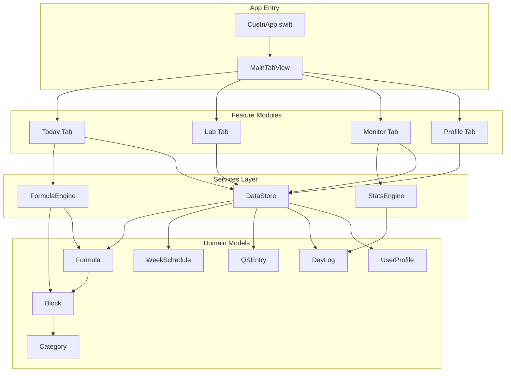
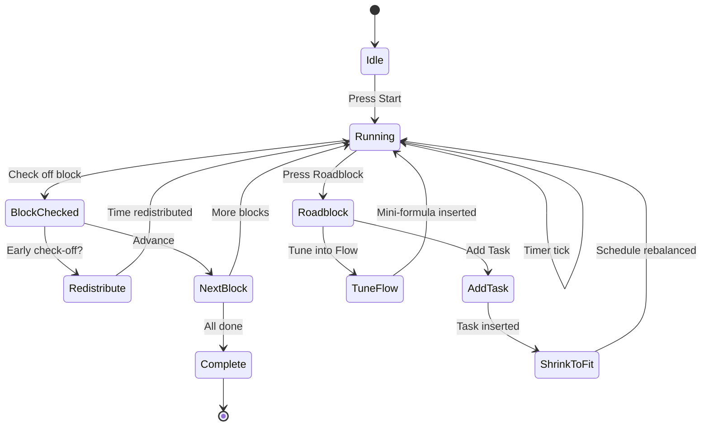

# CueIn Architecture Diagram

> A visual guide to the app's module structure, data flow, and folder organization.

---

## High-Level Architecture



---

## Data Flow

```mermaid
flowchart LR
    subgraph Input
        User["User Action"]
    end

    subgraph Processing
        VM["ViewModel"]
        Engine["FormulaEngine"]
        Store["DataStore"]
    end

    subgraph Output
        View["SwiftUI View"]
        Log["DayLog"]
    end

    User -->|tap / input| VM
    VM -->|start / check / insert| Engine
    VM -->|CRUD| Store
    Engine -->|timer tick| Engine
    Engine -->|block state| VM
    Store -->|@Published| VM
    VM -->|@Published| View
    Engine -->|generateDayLog| Log
    Log --> Store
```

---

## Today Tab — Interaction Flow



---

## Folder Map

```
CueIn/
├── App/                          ← Entry point & root navigation
│   ├── CueInApp.swift               DataStore injection, dark mode
│   └── MainTabView.swift             Custom 4-tab navigation
│
├── Models/                       ← Pure data structures (no UI)
│   ├── Block.swift                   FlowLogic, BlockPriority, Block
│   ├── Formula.swift                 FormulaType, Formula
│   ├── Category.swift                BlockCategory enum + subcategories
│   ├── WeekSchedule.swift            DayOfWeek, DayAssignment, WeekSchedule
│   ├── QSEntry.swift                 QSInputType, QSEntry, QSRecord
│   ├── DayLog.swift                  BlockLogEntry, DayLog
│   └── UserProfile.swift             Goal, UserProfile
│
├── Services/                     ← Business logic (no UI)
│   ├── DataStore.swift               Central data store, seed data
│   ├── FormulaEngine.swift           Timer, flow logic, rebalancing
│   └── StatsEngine.swift             Averages, streaks, adherence
│
├── DesignSystem/                 ← Reusable visual atoms
│   ├── Theme.swift                   Colors, fonts, spacing, radii
│   ├── Components/
│   │   ├── CueButton.swift           4-style button
│   │   ├── CueCard.swift             Dark card container
│   │   ├── CueProgressBar.swift      Animated progress bar
│   │   ├── CueChip.swift             Category tag chip
│   │   └── CueBlockRow.swift         Block row with timer
│   └── Modifiers/
│       └── GlassBackground.swift     Glassmorphism modifier
│
├── Features/                     ← Feature modules (1 folder per tab)
│   ├── Today/
│   │   ├── TodayView.swift           Main layout
│   │   ├── TodayViewModel.swift      State management
│   │   ├── BlockRowView.swift        Detailed block row
│   │   ├── RoadblockSheet.swift      Interruption menu
│   │   └── AddTaskSheet.swift        Add-a-task flow
│   ├── Lab/
│   │   ├── LabView.swift             Main layout
│   │   ├── LabViewModel.swift        State management
│   │   ├── WeekOverviewView.swift    7-day strip
│   │   ├── FormulaEditorView.swift   Formula builder
│   │   └── FormulaCard.swift         Formula list card
│   ├── Monitor/
│   │   ├── MonitorView.swift         Stats/QS toggle
│   │   ├── MonitorViewModel.swift    State management
│   │   ├── StatsView.swift           Stats dashboard
│   │   ├── HeatmapView.swift         30-day heatmap
│   │   ├── BarChartView.swift        7-day bar chart
│   │   ├── AveragesView.swift        Category averages
│   │   └── QSView.swift              Daily data input
│   └── Profile/
│       ├── ProfileView.swift         Stage, goals, strategy
│       └── ProfileViewModel.swift    State management
│
└── docs/                         ← Documentation (not compiled)
```

---

## Key Architecture Decisions

| Decision | Rationale |
|---|---|
| **MVVM** | Clean separation: Views render, ViewModels manage state, Models hold data |
| **Services as singletons** | `DataStore` is shared across all tabs; `FormulaEngine` runs independently |
| **Feature folders** | Each tab is self-contained — easy to find, modify, or replace |
| **Design system** | Consistent styling through `Theme` + reusable components |
| **In-memory DataStore** | V1 simplicity; swap to SwiftData later without changing interfaces |
| **Passive models** | Models are `struct` + `Codable` — no business logic in models |

---

## How to Read and Navigate

1. **Start with a tab** → go to `Features/<Tab>/` — the `*View.swift` is the layout, `*ViewModel.swift` is the logic.
2. **Understand a concept** → go to `Models/` — every domain object lives here.
3. **Trace data flow** → `View` calls `ViewModel` method → `ViewModel` calls `Service` → Service updates `@Published` → View re-renders.
4. **Add a new feature** → create a new file in the appropriate `Features/` folder, reuse components from `DesignSystem/`.
